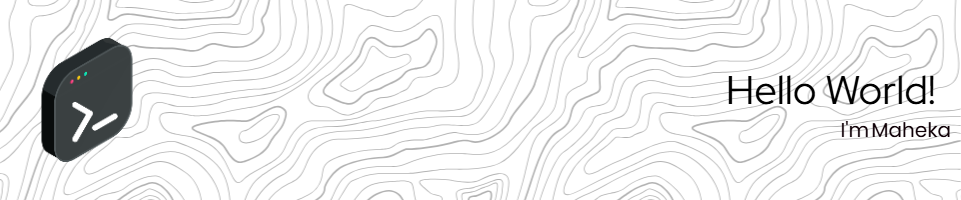

# 👋🏼 Well Hello There, I'm Maheka!
I’m a passionate web developer and student at **SMKS Wira Harapan**, diving deep into the world of **media-based computer science**. I love turning coffee into code and ideas into interactive web apps.

<picture>
  <source media="(prefers-color-scheme: dark)" srcset="https://raw.githubusercontent.com/Yukanakami/Yukanakami/output/github-snake-dark.svg" />
  <source media="(prefers-color-scheme: light)" srcset="https://raw.githubusercontent.com/Yukanakami/Yukanakami/output/github-snake.svg" />
  
</picture>

---

## 💻 What I’m Up To

🧠 **Currently Building**  
just making a web for practice

🧩 **Looking to Learn**  
Currently sharpening my skills in **Next.js**, **Python**, **C#**, and **C++** – always chasing that next “Nahhhh” moment.

💡 **Curious About**  
API security, WebSocket integration, and scaling web projects with better Git workflows.

🎯 **Ask Me About**  
- How to structure a PHP project 
- Tailwind CSS tips & tricks  
- Building CRUD systems from scratch

☕ **Fun Fact**  
I work best at night, with a cup of Americano in hand and lo-fi beats in the background.

---

## 🌐 Connect with Me

---

## ⚙️ Tech Stack
Here’s what’s in my toolbox:

`Web & Backend:`  
 
  
 

`Frontend:`  
 

`Others:`  
 
 
  
 

---

## 📊 GitHub Stats

  
  

---

## 💬 Dev Quote of the Day

---

## 🚀 Most Active Projects

---

